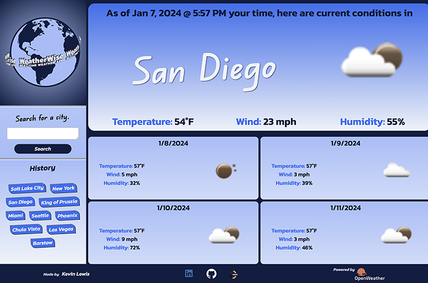

# **_WeatherWise_**

 

## Overview

Get your 5-day forecast for cities around the globe with this simple app!
 

## Application Instructions

1. Visit https://astounding-trifle-53a7a0.netlify.app/ 
2. Enter a city name and click "Search". 
3. Current conditions will show in the main section. Weather for the next 4 days will show below. 
4. Your last 10 searches save in the "History" section. Click any of these buttons to view that city's weather again. 

## App Screenshots

##

## Technologies Utilized

• HTML 
• CSS 
• JavaScript 
• OpenWeatherMap.org API

## Contributors To This Application

Kevin Lewis

 

# **_Thank you for using this App!_**

## Contact me @...

&nbsp; kevdev@myyahoo.com

&nbsp; https://github.com/KPL33